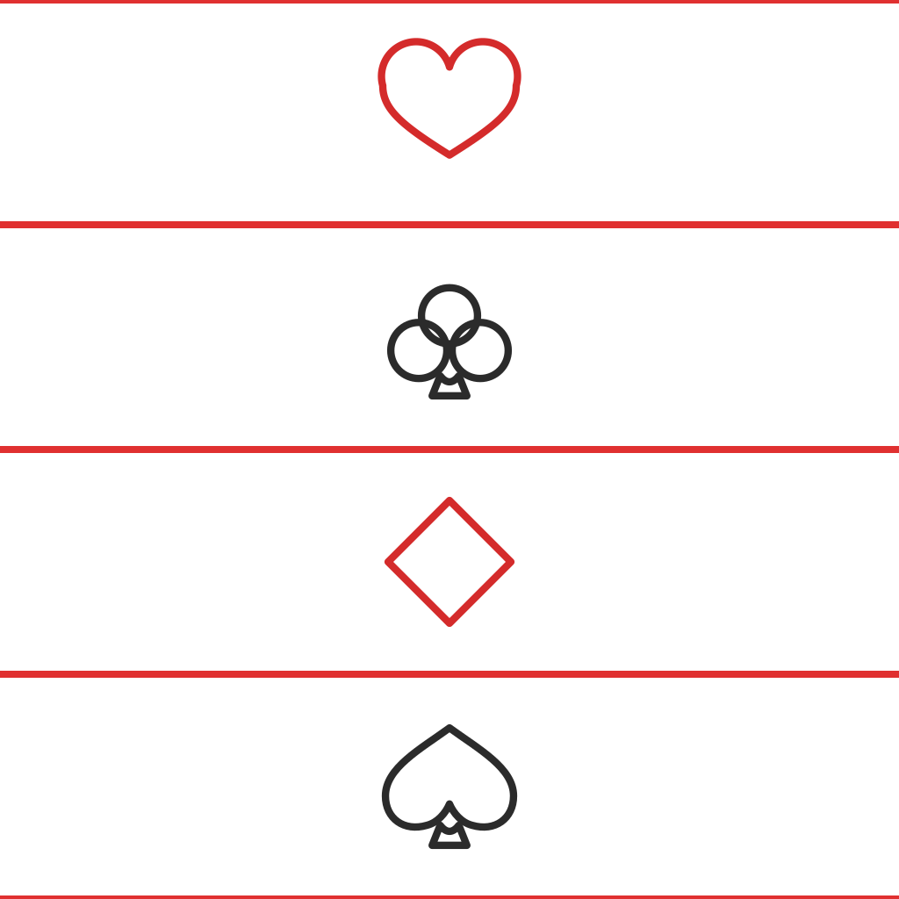

  
  <h1>إكة — Ekka</h1>
  
<strong>فن البلوت السعودي</strong> | The Art of Saudi Baloot

   
  <!-- Badges -->
  
  
  
  

---

## عن التطبيق | About

**إكة** هي لعبة بلوت سعودية أصيلة، مصممة للعب المحلي بدون اتصال بالإنترنت.
العب ضد ذكاء اصطناعي متقدم يحاكي أسلوب اللعب الحقيقي — المزايدة، المضاعفة، الإعلانات، وكل التفاصيل.

**Ekka** is an authentic Saudi Baloot card game built for offline play.
Challenge an advanced AI that mirrors real gameplay strategy — bidding, doubling, declarations, and all.

---

## المميزات | Features

| | |
|---|---|
| 🃏 | عقود كاملة: حكم أول، حكم ثاني، صن، أشكل |
| 🔄 | سلسلة مضاعفة: دبل → تربل → مربع → قهوة |
| 🏆 | إعلانات: تيرس، كارت، كانت، إكة، بلوت |
| 📊 | إحصائيات تفصيلية جولة بجولة |
| 🤖 | ذكاء اصطناعي متقدم بمحاكاة احتمالية |
| 📴 | يعمل بالكامل بدون إنترنت |

---

## لقطات الشاشة | Screenshots

> قريباً

<!-- Add screenshots below once available:

  
  
  
  

-->

---

## التحميل | Download

> قريباً على App Store و Google Play

---

## سياسة الخصوصية | Privacy Policy

[اقرأ سياسة الخصوصية](https://a7madksa.github.io/ekka/privacy.html)

---

## تواصل | Contact

a7madksa@gmail.com
